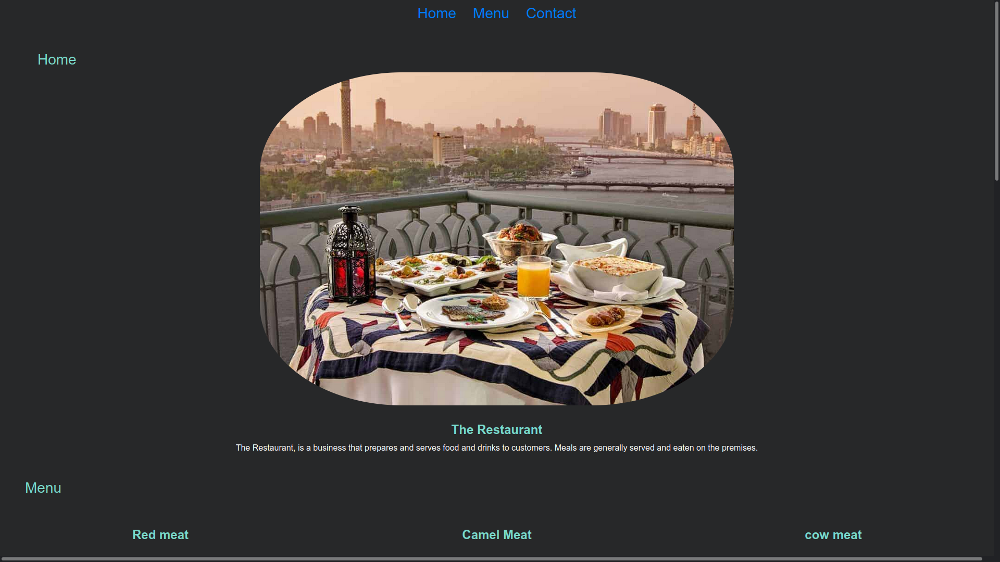

# The Restaurant

> This the project of the restaurant page built entirely with javascript and the good usage of webpack.

## Built with

- JavaScript
- Webpack
- HTML
- CSS
- Bootstrap
- Lots of love :heart:

## Live Demo

[Live Demo](https://shaher-11.github.io/restaurant-page/)

### Installation

In order to get the project on your local machine, please run the following commands on your terminal:

> 1. Run `https://github.com/Shaher-11/restaurant-page`
> 2. Run `cd restaurant-page`
> 3. Run `npm install --save-dev webpack`
> 4. Open index.html file with the browser

## Author:

 
 👤 **Shaher Shamroukh**
 
[<code></code>](https://github.com/Shaher-11)
[<code></code>](https://twitter.com/ShaherShamroukh/)
[<code></code>](https://www.linkedin.com/in/shaher-shamroukh/)
 
 

## 🤝 Contributing

Contributions, issues and feature requests are welcome!

Feel free to check the [issues page](https://github.com/Shaher-11/private-events/issues).

## Show your support

Give a ⭐️ if you like this project!

## Acknowledgments

- Microverse
- The Odin Project

## 📝 MIT License

This project is [MIT](lic.url) licensed.
